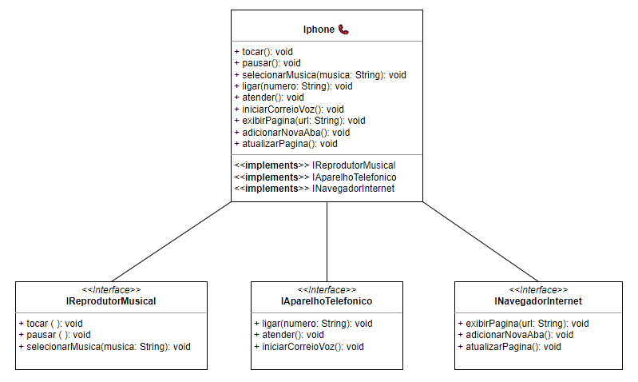

## Getting Started

Welcome to the VS Code Java world. Here is a guideline to help you get started to write Java code in Visual Studio Code.

## Folder Structure

Classes e Interfaces

* iPhone (implementa IReprodutorMusical, IAparelhoTelefonico, INavegadorInternet)

* IReprodutorMusical

- void tocar()
- void pausar()
- void selecionarMusica(String musica)

* IAparelhoTelefonico

- void ligar(String numero)
- void atender()
- void iniciarCorreioVoz()

* INavegadorInternet

- void exibirPagina(String url)
- void adicionarNovaAba()
- void atualizarPagina()

